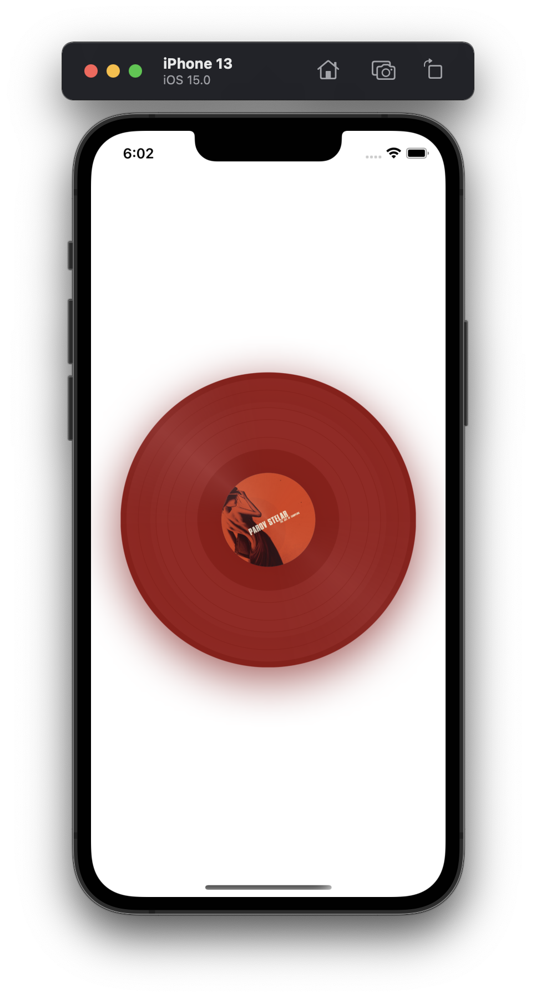
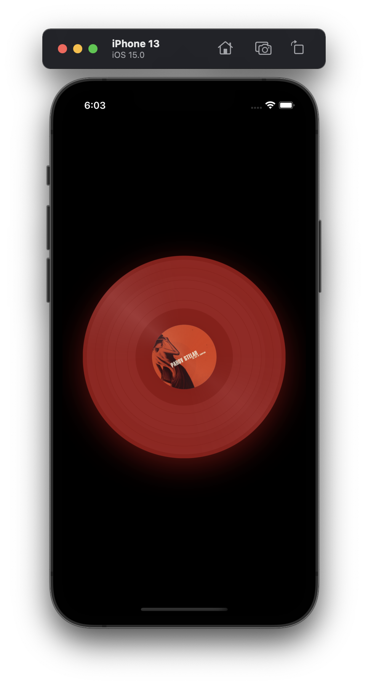

`german word for vinyl record`
# Schallplatte

<br/>

Is a SwiftUI experiment for rendering vinyl records. Below you can view an example:
| Lightmode | Darkmode |
:------:|:------:
|  |  |

```swift
import SwiftUI

struct ContentView: View {
    
    var body: some View {
        VStack {
            Schallplatte(
              vinylColor: Color(
                red: 0.49, green: 0, blue: 0, opacity: 1
              ), 
              imgUrl: "https://images-na.ssl-images-amazon.com/images/I/71GtacY5FQL._SL1400_.jpg",
              gradationIntensity: .strong, 
              showCenter: false
            )
        }
    }
}
```